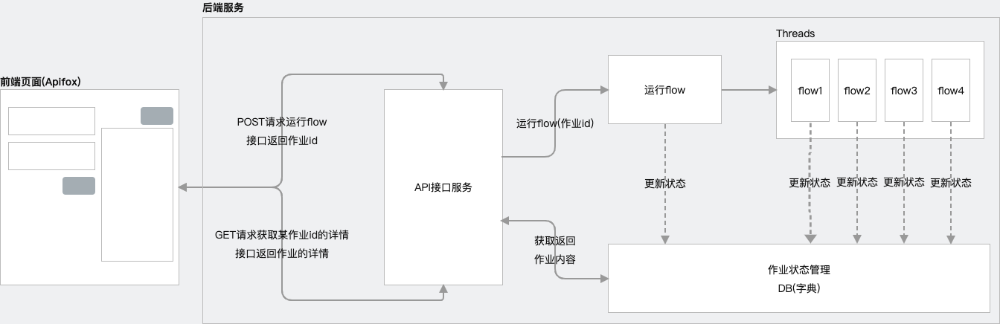

# 1、项目介绍
## 1.1、本次分享介绍
本期视频主要实现使用Flask后端框架+CrewAI实现AI Agent复杂工作流项目案例                                
**(1)本次分享内容主要为:**               
(a)分享的项目案例是在“营销战略协作智能体”项目的基础之上进行迭代，那本期视频也会从零进行操作演示(无需看以往相关视频)                                                         
(b)代码实现CrewAI的Flows功能，并记录Flow运行中间结果，支持多Flow并行运行                              
(c)代码实现将AI Agent工作流对外封装API接口提供服务，并使用Apifox进行前后端联调测试，支持运行、查看Flow                   
**(2)项目案例业务流程图如下所示:**        
               
**(3)另外:关于“营销战略协作智能体”项目案例，已分享的视频供大家参考:**                  
(a)单Crew运行案例,相关视频链接如下所示:                                                                                
【Agent应用案例5-进阶】让任务以JSON数据格式并最终任务以JSON格式输出，CrewAI+FastAPI打造多Agent协作应用并对外提供API服务                                   
https://www.bilibili.com/video/BV1i5bAeAEWn/?vd_source=30acb5331e4f5739ebbad50f7cc6b949                 
https://youtu.be/w8uxBuVQVlg       
(b)单Crew封装后端服务案例,相关视频链接如下所示:                                                     
从零到一！打造多Agent协作AI全栈应用：后端服务构建及联调，CrewAI、Flask与Vue.js的完美结合！支持GPT、国产大模型与Ollama本地大模型                        
https://www.bilibili.com/video/BV1r7x1eJEVV/?vd_source=30acb5331e4f5739ebbad50f7cc6b949                        
https://youtu.be/xyWicC0UI94                                
(c)Pipelines运行案例,相关视频链接如下所示:                         
快速搭建AI Agent工作流，硬核干货源码共享，CrewAI中Pipelines功能实操、源码剖析，同时支持gpt大模型、主流国产大模型、本地开源大模型                                 
https://www.bilibili.com/video/BV18LCdYpE5Z/?vd_source=30acb5331e4f5739ebbad50f7cc6b949                        
https://youtu.be/BhXZn2NaJYs        
(d)Flows运行案例,相关视频链接如下所示:                         
快速搭建AI Agent复杂工作流，硬核干货源码共享，CrewAI中Flows核心功能实操、源码剖析，同时支持gpt大模型、主流国产大模型、本地开源大模型                    
https://www.bilibili.com/video/BV1jgyeYgEyb/?vd_source=30acb5331e4f5739ebbad50f7cc6b949                         
https://youtu.be/RfnQHdDVg68                   

## 1.2 CrewAI介绍
### (1)简介    
CrewAI是一个用于构建多Agent系统的工具，它能够让多个具有不同角色和目标的Agent共同协作，完成复杂的Task                
该工具可以将Task分解，分配给不同的Agent，借助它们的特定技能和工具，完成各自的职责，最终实现整体任务目标              
官网:https://www.crewai.com/                                          
GitHub:https://github.com/crewAIInc/crewAI                                           
### (2)核心概念
**(1)Agents**          
是一个自主可控单元，通过编程可以实现执行任务、作出决定、与其他Agent协作交流，可类比为团队中的一员，拥有特定的技能和任务                                        
role(角色):定义Agent在团队中的角色                                          
goal(目标):定义Agent需要实现的目标                             
backstory(背景信息):定义Agent的背景描述信息                                              
**(2)Tasks**               
分配给Agent的具体任务，并定义任务所需的所有细节                                               
description(任务描述):简明扼要说明任务要求                                                 
agent(分配的Agent):分配负责该任务的Agent                                                
expected_output(期望输出):期望任务完成后输出的详细描述                                                         
Tools(工具列表):为Agent提供可用于执行该任务的工具列表                   
output_json(输出json):设置任务的输出为自定义的json数据格式                                
output_file(输出到文件):将任务结果输出到一个文件中，指定输出的文件格式                                                     
context(上下文):指定其输出被用作该任务上下文的任务                                  
**(3)Processes**                      
CrewAI中负责协调Agent执行任务,类似于团队中的项目经理,确保任务分配和执行效率与预定计划保持一致                       
目前拥有两种运行机制:                             
sequential(按顺序运行):以深思熟虑、系统化的方式推进各项任务，按照任务列表中预定义的顺序执行，一个任务的输出作为下一个任务的上下文                               
hierarchical(按顶层规划运行):允许指定一个自定义的管理角色的Agent，负责监督任务执行，包括计划、授权和验证。任务不是预先分配的，而是根据Agent的能力进行任务分配，审查产出并评估任务完成情况                          
**(4)Crews**          
1个crew代表一个协作团队，即一组协作完成一系列任务的Agent                            
Agents(Agent列表):分配给crew的Agents                                   
Tasks(任务列表):分配给crew的Tasks                                                
Process(运行机制):sequential(按顺序运行)、hierarchical(按顶层规划运行)                                                 
manager_llm(大模型):在Process为hierarchical下指定的大模型                                    
**(5)Flows**          
为构建复杂的AI Agent WorkFlow(工作流)设计的一个强大的技术框架                 
**核心特点:**           
(a)简化工作流程创建                      
轻松串联多个crew和任务(自定义的方法)，创建复杂的工作流              
(b)状态管理                  
Flows可以在工作流中的不同任务之间轻松管理和共享状态              
(c)事件驱动架构                                         
基于事件驱动模型构建可实现动态响应的工作流           
(d)灵活的控制流                 
在工作流中实现条件逻辑、循环、分支等逻辑控制                   
**关键参数:**            
(a)@start()装饰器                               
用于将一个方法标记为Flow的起点。在一个Flow中支持对多个方法进行@start()标记，当Flow启动时，所有用@start()装饰的方法都会并行执行           
(b)@listen装饰器                                    
用于将一个方法标记为Flow中的监听器。在一个Flow中支持对多个方法进行@listen()装饰，当Flow启动后被监听的方法执行完成后，所有用@listen()监听该方法的方法都会被执行             
(c)@router装饰器                                                         
在Flow中允许根据方法的输出内容来定义路由的执行逻辑，根据方法的输出指定不同的路由，从而动态控制执行流程                     
**条件控制:**              
(a)条件逻辑 or_()                             
Flows中@listen()中可以使用or_()函数允许监听多个方法，在这些被监听方法中任何一个执行完成后，监听该方法的方法就会被执行               
(b)条件逻辑 and_()                                           
Flows中@listen()中可以使用and_()函数允许监听多个方法，在这些被监听方法中全部执行完成后，监听该方法的方法就会被执                 
**结果输出:**                 
(a)检索结果的最后输出                              
运行Flow时，最终的输出是由最后完成的方法决定的                                 
(b)访问和更新状态                                  
状态可用于在Flow中的不同方法之间存储和共享数据                       
(c)状态管理                  
有效管理状态对于构建可靠、可维护的AI工作流至关重要。 Flows为非结构化、结构化状态管理提供了强大的机制，允许根据需求自行选择            
非结构化状态管理:所有状态都存储在Flow类的状态属性中。这种方法具有很大的灵活性，开发人员可随时添加或修改状态属性，而无需定义严格的模式            
结构化状态管理:利用预定义的模式来确保整个工作流程的一致性和类型安全性                      

## 1.3、应用案例简介               
### (1)定义了3个Agent        
lead_market_analyst:           
  role: >            
    **首席市场分析师**               
  goal: >              
    以敏锐的洞察力对客户提供的产品和竞争对手进行深入的剖析，并为营销战略的制定提供专业指导。              
  backstory: >               
    你任职在一家一流数字营销公司，你的职位是首席市场分析师。               
    你的专长是以敏锐的洞察力对客户提供的产品和竞争对手进行深入的剖析。                     
chief_marketing_strategist:                
  role: >               
    **首席营销战略师**                 
  goal: >               
    基于产品的市场分析内容，以敏锐的洞察力制定出令人惊喜的营销战略。                   
  backstory: >                 
    你任职在一家一流数字营销公司，你的职位是首席营销战略师。                  
    你的专长是能够制定出成功的定制营销战略。               
creative_content_creator:           
  role: >               
    **首席创意内容创作师**               
  goal: >                  
    基于产品的营销战略内容，为社交媒体活动开发有吸引力的创新内容。               
    重点是创建高影响力的广告文案。                 
  backstory: >               
    你任职在一家一流数字营销公司，你的职位是首席创意内容创作师。             
    你的专长是能够将营销战略转化为引人入胜的故事和视觉内容，吸引注意力并激发行动。                 
### (2)定义了5个Task       
**research_task:**             
  description: >                
    基于客户提供的{customer_domain}对客户提供的产品和竞争对手进行深入的剖析。请确保找到任何有趣的相关信息，日期限定为2024年。                
    我们正在就以下项目与他们合作：            
    {project_description}。            
  expected_output: >              
    关于客户、客户提供的产品和竞争对手的完整报告、包括指标统计、偏好、市场定位和受众参与度。              
  agent: lead_market_analyst                      
**project_understanding_task:**                 
  description: >                    
    了解{project_description}的项目细节和目标受众。查看提供的任何材料，并根据需要收集更多信息。                 
  expected_output: >                  
    项目的详细摘要和目标受众的简介。                 
  agent: chief_marketing_strategist                   
**marketing_strategy_task:**               
  description: >                 
    基于客户提供的{customer_domain}和{project_description}为项目制定全面的营销战略。                   
    充分使用从研究任务和项目理解任务中获得的见解来制定高质量的战略。               
  expected_output: >                  
    一份详细的营销战略文件，概述目标、目标受众、关键信息和建议的策略，确保包含名称、策略、渠道和关键绩效指标。                   
  agent: chief_marketing_strategist                
**campaign_idea_task:**                  
  description: >                  
    为{project_description}开发富有创意的营销活动构思。               
    确保创意新颖、吸引人，并与整体营销战略保持一致。                 
  expected_output: >                  
    列出 5 个活动设想，每个设想都有简要说明和预期影响。                   
  agent: creative_content_creator                      
**copy_creation_task:**                
  description: >                  
    根据已获批准的{project_description}活动创意制作营销文案。                   
    确保文案引人注目、清晰明了，并适合目标受众。                  
  expected_output: >                 
    每个活动创意的营销副本。                  
  agent: creative_content_creator                                                                    

# 2、前期准备工作
## 2.1 开发环境搭建:anaconda、pycharm
anaconda:提供python虚拟环境，官网下载对应系统版本的安装包安装即可                                      
pycharm:提供集成开发环境，官网下载社区版本安装包安装即可                                               
可参考如下视频进行安装，【大模型应用开发基础】集成开发环境搭建Anaconda+PyCharm                                                          
https://www.bilibili.com/video/BV1q9HxeEEtT/?vd_source=30acb5331e4f5739ebbad50f7cc6b949                             
https://youtu.be/myVgyitFzrA          

## 2.2 大模型相关配置
(1)GPT大模型使用方案              
(2)非GPT大模型(国产大模型)使用方案(OneAPI安装、部署、创建渠道和令牌)                 
(3)本地开源大模型使用方案(Ollama安装、启动、下载大模型)                         
可参考如下视频:                         
提供一种LLM集成解决方案，一份代码支持快速同时支持gpt大模型、国产大模型(通义千问、文心一言、百度千帆、讯飞星火等)、本地开源大模型(Ollama)                       
https://www.bilibili.com/video/BV12PCmYZEDt/?vd_source=30acb5331e4f5739ebbad50f7cc6b949                 
https://youtu.be/CgZsdK43tcY                                                                      

## 2.3 Apifox          
官网下载软件安装即可，进行接口调试                          
https://apifox.com/                

# 3、项目初始化
## 3.1 下载源码
GitHub或Gitee中下载工程文件到本地，下载地址如下：                
https://github.com/NanGePlus/CrewAIFlowsFullstackTest          
https://gitee.com/NanGePlus/CrewAIFlowsFullstackTest                 

## 3.2 构建项目
使用pycharm构建一个项目，为项目配置虚拟python环境               
项目名称：CrewAIFlowsFullstackTest

## 3.3 将相关代码拷贝到项目工程中           
直接将下载的文件夹中的文件拷贝到新建的项目目录中               

## 3.4 安装项目依赖          
命令行终端中执行cd crewaiFlowsBackend 命令进入到该文件夹内，然后执行如下命令安装依赖包                                           
pip install -r requirements.txt            
每个软件包后面都指定了本次视频测试中固定的版本号           
**注意:** 截止2024.10.23，本项目crewai最新版本0.74.2，crewai-tools最新版本0.13.2，建议先使用要求的对应版本进行本项目测试，避免因版本升级造成的代码不兼容。测试通过后，可进行升级测试。          

# 4、项目测试          
### （1）运行main脚本启动API服务
在使用python main.py命令启动脚本前，需根据自己的实际情况做如下配置:
(a)调整utils/myLLM.py代码中关于大模型配置相关的参数:                           
**openai模型相关配置 根据自己的实际情况进行调整**              
OPENAI_API_BASE = "https://api.wlai.vip/v1"            
OPENAI_CHAT_API_KEY = "sk-XmrIEFplNArLlYa0E8C5A7C5F82041FdBd923e9d115746D0"          
OPENAI_CHAT_MODEL = "gpt-4o-mini"           
**非gpt大模型相关配置(oneapi方案 通义千问为例) 根据自己的实际情况进行调整**              
ONEAPI_API_BASE = "http://139.224.72.218:3000/v1"            
ONEAPI_CHAT_API_KEY = "sk-0FxX9ncd0yXjTQF877Cc9dB6B2F44aD08d62805715821b85"               
ONEAPI_CHAT_MODEL = "qwen-max"               
**本地大模型相关配置(Ollama方案 qwen2.5:7b为例) 根据自己的实际情况进行调整**             
OLLAMA_API_BASE = "http://localhost:11434/v1"                
OLLAMA_CHAT_API_KEY = "ollama"          
OLLAMA_CHAT_MODEL = "qwen2.5:7b"            
**(b)调整main.py中CrewAI默认的大模型环境变量配置，主要目的是解决Task中output_json属性依赖大模型问题**                                 
os.environ["OPENAI_API_BASE"] = "https://api.wlai.vip/v1"             
os.environ["OPENAI_API_KEY"] = "sk-dvdCgdO3LSWYgqnMiJR5NqG0eLSTM69yjryjD6LuL3lWkvf3"              
os.environ["OPENAI_MODEL_NAME"] = "gpt-4o-mini"     
**(c)其他相关配置**                                                
选择大模型类型 openai:调用gpt大模型;oneapi:调用非gpt大模型;ollama:调用本地大模型                  
LLM_TYPE = "openai"                    
设置SERPER_API_KEY环境变量，用于Google搜索引擎的API                
os.environ["SERPER_API_KEY"] = "ddfea55d4d309045283e518773f11b872c318f0d"                  
服务访问的端口                
PORT = 8012                           
### （2）打开Apifox进行测试            
在Apifox中新建项目，将提供的crewaiFlowsBackend文件夹下的./others/api.json接口文件导入            
然后，测试运行crew POST请求                
http://127.0.0.1:8012/api/crew                  
获取某次运行crew作业详情 GET请求                    
http://127.0.0.1:8012/api/crew/{jobId}        
请求体内容:              
{                 
    "customer_domain": "https://www.emqx.com/zh",                          
    "project_description": "EMQX是一种开源的分布式消息中间件，专注于处理物联网 (IoT) 场景下的大规模消息通信。它基于MQTT协议，能够实现高并发、低延迟的实时消息推送，支持设备之间、设备与服务器之间的双向通信。客户领域:分布式消息中间件解决方案,项目概述:创建一个全面的营销活动，以提高企业客户对 EMQX 服务的认识和采用。"                 
}                  

